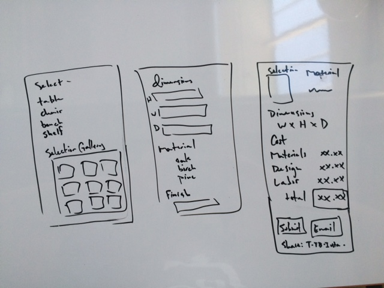

#Wood Work Cost Estimator

###Puprose:

Provide an interface for customers seeking custom furniture to get imediate and accurate estimates based on a variety of designs and materials. Key features will include material choice and custom dimension input. Users will be able to share this estimate as well as submit it for approval.

###technology needed

* HTML
* CSS
* JavaScript
* jQuery
* JSON
* AJAX
* HomeDepot API
* Jasmine

###implementation

* OOP
* Test Driven

###Wire Framing

###Foreseen Difficulties:

* Integrating data from the API
* Adjusting cost based on dimensions
* rendering multple pages
* Allowing for finished estimate to be emailed/shared/submitted

###Stretch Goals

* Easily Updatable by non-programmer
* Price comparison with Lowes API

